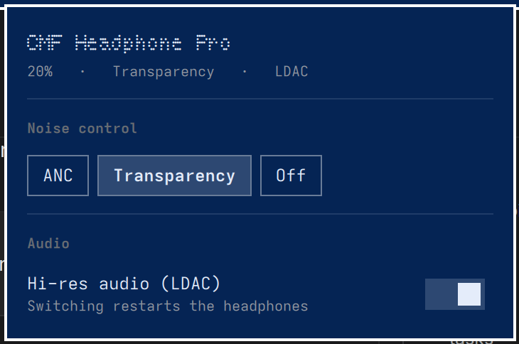

# CMF Headphones — Omarchy bar widget

Battery, active noise mode and LDAC status for a **CMF Headphone Pro** in the
Omarchy bar, with noise control in the popup. No phone app involved.



The bar icon is Nothing's dot-matrix headphone mark, drawn as real QML circles
so it takes the bar's foreground colour and dims when the headphones are off.

## Requires

**[cmfctl](https://github.com/SoftARV/cmfctl)** on `PATH` — it owns the
Bluetooth protocol; this widget only renders what it reports.

```bash
git clone https://github.com/SoftARV/cmfctl.git
cd cmfctl && ./install.sh
cmfctl status --json     # should print battery, anc, ldac
```

## Install

```bash
omarchy plugin add https://github.com/SoftARV/omarchy-cmf-headphones.git --enable
omarchy bar put softarv.cmf-headphones --before omarchy.audio
omarchy restart shell
```

`--enable` matters: plugins land **disabled** so their code can be reviewed
before it runs, and without it the widget installs and does nothing.

`omarchy restart shell` matters too: `rescanPlugins` reloads plugin code but
keeps the existing widget instance, so geometry changes appear not to apply.

Update it later with `omarchy plugin update softarv.cmf-headphones`, which
fast-forwards the checkout that `plugin add` left in place.

## What this plugin runs

Omarchy plugins are unsandboxed code inside the long-lived `omarchy-shell`
process, and the docs quite rightly tell you to read one before enabling it.
This is the whole of what this widget executes:

| | |
|--|--|
| `cmfctl status --json` | on a timer, and after any change |
| `cmfctl anc <mode>` | when you pick a noise mode |
| `cmfctl set SET_LHDC_COMMANDS 00\|01` | when you flip the LDAC switch |
| `gdbus monitor --system --dest org.bluez` | one long-lived read, to notice the headphones coming and going |

Nothing else. No network, no writes outside the shell's own config, no `sudo`.

## Keys, while the popup is focused

`a` ANC · `t` transparency · `o` off · `l` toggle LDAC · `r` refresh

While ANC is active a second row picks the level — Low, Mid, High, Adaptive.
It is hidden in transparency and off, where the levels mean nothing, matching
the phone app.

## Settings

| key | default | |
|-----|---------|--|
| `idlePollSec` | 120 | refresh interval while the popup is closed |
| `activePollSec` | 5 | refresh interval while it is open |
| `showBattery` | true | reserved — the bar currently shows the mark only |

## Notes

Toggling LDAC restarts the headphones — they power-cycle to apply the codec
change and re-pair themselves after ~6–9 seconds. The panel shows "Restarting…"
for that window rather than reporting them as disconnected, and the switch is
held inert until they return.

State is gathered with a single `cmfctl status --json` call. Each invocation
opens a fresh RFCOMM link and the connect dominates the cost, so fanning out
into one call per value would be both slow and prone to `EBUSY`.

The popup title uses the **Nothing Font** (SIL OFL). Without it installed the
title falls back to the bar's font; everything else is unaffected.

## Uninstalling

```bash
omarchy plugin remove softarv.cmf-headphones
```

That leaves `cmfctl` alone — remove it separately if you want it gone.

## Hacking on it

```bash
git clone https://github.com/SoftARV/omarchy-cmf-headphones.git
cd omarchy-cmf-headphones
./install.sh
./test/run.sh
```

`install.sh` **copies** the runtime files into
`~/.config/omarchy/plugins/softarv.cmf-headphones/`, so re-run it after editing
any `.qml`. It copies rather than symlinking because
`omarchy plugin validate` rejects a plugin folder containing **any** symlink —
a linked install validates as broken and the shell quietly never loads it. For
the same reason no test may write a symlink anywhere inside this repo.

Run from inside the plugins directory — where `omarchy plugin add` leaves the
whole repo — `install.sh` copies nothing, so the user's git checkout survives
and `omarchy plugin update` still works.

`./test/run.sh` needs neither a compositor nor headphones.

## Files

| | |
|--|--|
| `manifest.json` | plugin manifest and settings schema |
| `Panel.qml` | bar button and popup |
| `CmfService.qml` | polling, state, and the `cmfctl` calls |
| `NothingHeadphoneIcon.qml` | the dot-matrix mark |
| `install.sh` | copies the runtime files into place |
| `test/run.sh` | the test suite |

## Licence

MIT — see [LICENSE](LICENSE). Changes are in [CHANGELOG.md](CHANGELOG.md).
